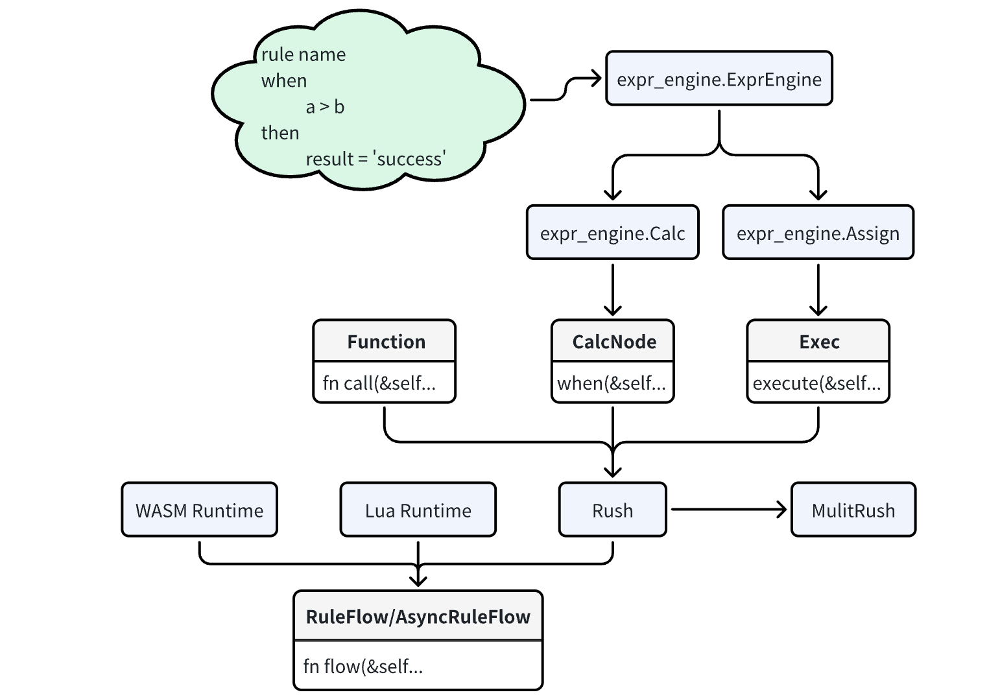

# Rush
[中文文档](https://juejin.cn/column/7281080737491025955)

Rush is a universal rules engine.

Rush provides a general computational abstraction. There can be multiple implementations and any combination.

Conditional parallel computing

## Quick start

```rust
const SIMPLE_RULE: &'static str = "
rule COMPLEX_RULE
when
    age > 18
then
    stage = 'adult'
";
fn main(){
    
    let rh = Rush::from(Into::<ExprEngine>::into([SIMPLE_RULE]));

    let res:HashMap<String,String> = rh.flow(r#"{"age":19}"#.parse::<Value>().unwrap()).unwrap();
    
    assert_eq!(res.get("stage").unwrap().as_str(),"adult");

}
```

Here, regular expressions are generated directly. You can actually implement some of them yourself to integrate with your own services.

[More examples](https://github.com/woshihaoren4/rush/tree/main/example/src)

## Keywords

The direct parsing rules are as follows:
```rust
The keyword cannot be repeated: when,then
rule [name] [description] [engine/default:expr] [...]
when
    [condition 1];
    [condition 2];
    ...
    [condition n];
then
    [key1 = execute 1];
    [key2 = execute 2];
    ...
    [keyn = execute n];
```

## Operators
- Modifiers: + - / * & | ^ % >> << 
- Comparators: > >= < <= == !=
- Logical ops: || &&
- Numeric constants, as i64, if have '.' as f64
- String constants (single quotes: 'foobar')
- Boolean constants: true false
- Parenthesis to control order of evaluation ( )
- Arrays [anything separated by , within parenthesis: [1, 2, 'foo']]
  - contain function example: `contain([1,2.3,'hello'],1)`
  - sub function： Find whether there are subsets of the two arrays
- Prefixes: ! - ~
- Null coalescence: null
- Function: function_name(args)result
- Input field by digits, letters and underscores，if field not found then condition is failed

## Function

You can add functions just like normal rust functions

```rust
    let rh = rh
        .register_function("abs", |i: i64| Ok(i.abs()));
```

[More function impl](https://github.com/woshihaoren4/rush/blob/main/example/src/function_test.rs)

## Lua

[More lua example](https://github.com/woshihaoren4/rush/blob/lua_engine/example/src/lua_test.rs)

```rust
    const LUA_RULE_SCRIPT: &'static str = r#"
    rule LUA_RULE_SCRIPT _ lua
    lua_script:
    function handle(req)
        local resp = {}

        if req.source == ONLINE_CHANNEL then
            resp.message = "线上渠道"
        elseif req.source == OFFLINE_CHANNEL then
            resp.message = "线下渠道"
        else
            resp.message = "未知渠道:"..req.source
        end

        return resp
    end

    return {handle_function="handle"}
    "#;
```

## WASM

[More wasm example](https://github.com/woshihaoren4/rush/blob/main/example/src/wasm_test.rs)

Compile a wasm file with the following code, use command `cargo build --target wasm32-unknown-unknown --release`
```rust
extern "C" {
    fn success(ptr: *const u8, len: usize) -> u32;
}

#[no_mangle]
pub extern "C" fn handle(ptr: *mut c_char, len: u32) -> u32 {
    unsafe {
        let slice = std::slice::from_raw_parts(ptr, len as usize);
        let cs = CStr::from_ptr(slice.as_ptr());
        let cs = CString::from(cs);
        let s = cs.to_str().unwrap();
        let s = format!(r#"{{"input":{}}}"#, s);

        success(s.as_ptr(), s.len());
    }
    1u32
}
```

Refer to this file in the rule and call：
```rust
    const WASM_RULE: &'static str = "
    rule WASM_RULE _ wasm
    wasm_file: wasm_example/wasm_example_one.wasm
    ";

    #[tokio::test]
    async fn test_wasm_build() {
        let rt = WasmRuntimeFactory::new().async_build(WASM_RULE).await.unwrap();

        let result: HashMap<String, String> =
            rt.async_flow(Value::String("hello".into())).await.unwrap();
      
        assert_eq!(result.get("input").unwrap().as_str(), "hello");
    }
```


## Abstraction and Structure



## Benchmark

If you're concerned about the overhead of this library, a good range of benchmarks are built into this repo. You can run them with `cargo bench -- --verbose` The library is built with an eye towards being quick, but has not been aggressively profiled and optimized. For most applications, though, it is completely fine.

[benchmark detail](https://github.com/woshihaoren4/rush/tree/main/example/benches)

Here are my test results，at MacBook Pro,CPU 2.6 GHz Intel Core i7, [lowest, average, highest]

```bash
assign_simple_parse  time:   [620.70 ns 625.08 ns 630.18 ns]
rule_full_parse      time:   [7.5513 µs 7.5794 µs 7.6094 µs]
multi_flow           time:   [15.363 µs 15.721 µs 16.184 µs]
sync_flow            time:   [2.9953 µs 3.0295 µs 3.0700 µs]
single_parse         time:   [165.08 ns 174.83 ns 186.49 ns]
simple_parse         time:   [2.6358 µs 2.6470 µs 2.6591 µs]
full_parse           time:   [19.868 µs 20.089 µs 20.356 µs]
have_function_rush   time:   [6.9074 µs 6.9507 µs 7.0011 µs]
lua_async_flow       time:   [10.731 µs 10.847 µs 10.970 µs]
wasm_async_flow      time:   [8.7260 µs 8.8046 µs 8.8806 µs]
```

## Plan

Expressions are currently supported as cells of count. Future support for lua and wasm is also planned。

## License
This project is licensed under the MIT general use license. You're free to integrate, fork, and play with this code as you feel fit without consulting the author, as long as you provide proper credit to the author in your works.